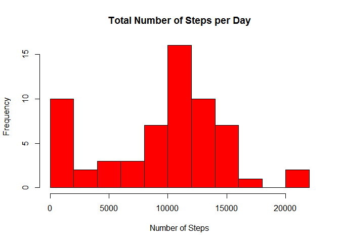

# Reproducible Research: Peer Assessment 1
This assignment makes use of data from a personal activity monitoring device.
This device collects data at 5 minute intervals through out the day.
The data consists of two months of data from an anonymous individual collected
during the months of October and November, 2012 and include the number of steps 
taken in 5 minute intervals each day.


```r
procdate <- Sys.time()
```
The data analysis below has been performed on 2015-05-16 16:10:09.

## Loading and preprocessing the data
First, the data are extracted from the .zip file and loaded for further
analysis. The data set is tidy and requires no preprocessing.


```r
unzip("activity.zip")
dat <- read.csv("activity.csv", na.strings = "NA")
# Remove the .csv file to keep the directory clean
invisible(file.remove("activity.csv"))
```

## What is mean total number of steps taken per day?
The mean total number of steps is calculated by first determining the number of
steps per day. The intervals without available step counts are ignorred, i.e. 
set to zero. 


```r
# Create a new data frame consisting of the total numbers of steps per day, with
# 0 indicating either absence of data or days without counted steps.
dailydat <- aggregate(.~date, dat, FUN = sum, na.rm=TRUE, na.action = "na.pass")
library(stats)
bin <- 2000
hist(dailydat$steps, 
     breaks = seq(0, ceiling(range(dailydat$steps)[2]/bin)*bin, by = bin), 
     main = "Total Number of Steps per Day",
     xlab = "Number of Steps", col = "Red")
```

 

```r
meansteps <- mean(dailydat$steps)
mediansteps <- median(dailydat$steps)
```
The mean and median values of the total number of steps taken per day are 
9354.2295082 and 10395, respectively.

## What is the average daily activity pattern?
For this question a plot showing the average number of steps in each interval 
as a function of the interval is shown below.


```r
intervaldat <- aggregate(.~interval, dat, FUN = mean, na.rm=TRUE, 
                         na.action = "na.pass")
with(intervaldat, plot(interval, steps, type = "l" , 
             main = "Average Number of Steps per 5-Minute Interval",
             xlab = "Interval Indicator", ylab = "Steps per Interval"))
```

 

```r
maxsteps <- max(intervaldat$steps)
intmax <- intervaldat$interval[which(intervaldat$steps == maxsteps)]
```

The interval withe highest number of steps is 835 with 206.1698113 on
average.

## Imputing missing values
To avoid bias due to ignorring NA values, the missing data are replaced by
representative values, which are chosen to be the median values of the
interval. This choice is motivated by the robustness of the median against
outliers and the ability to minimally affect temporal resolution. 


```r
cntmiss <- sum(is.na(dat$steps))
frac <- cntmiss/nrow(dat)
```

The total number of missing data is 2304, which corresponds to a fraction
of 0.1311475 of the data.


```r
intmed <- aggregate(.~interval, dat, FUN = median, na.rm=TRUE, 
                         na.action = "na.pass")
datnew <- dat
# Create a vector of the median values for each interval that matches the
# length of the dataset
medsteps <- sapply(datnew$interval, function(x) {
                intmed$steps[which(intmed$interval == x)]} )
datnew$steps <- ifelse(is.na(datnew$steps), medsteps, datnew$steps)

# Compute the daily averages and plot a histogram with the new data
dailydatnew <- aggregate(.~date, datnew, FUN = sum, na.rm=TRUE, 
                         na.action = "na.pass")
bin <- 2000
hist(dailydatnew$steps, 
     breaks = seq(0, ceiling(range(dailydatnew$steps)[2]/bin)*bin, by = bin), 
     main = "Total Number of Steps per Day",
     xlab = "Number of Steps", col = "Blue")
```

 

```r
meanstepsnew <- mean(dailydatnew$steps)
medianstepsnew <- median(dailydatnew$steps)
```

The mean and median values of the total number of steps taken per day are 
9503.8688525 and 10395, respectively. Compared with the
results from the data without missing data (9354.2295082 and 10395,
respectively), inputting values for the missing data did not affect the median 
value, but increased the mean value. Ignorring missing data thus biases the mean towards lower values, which makes sense as absent step counts are treated as if 
they are equal to zero, whereas in reality nonzero values are to be expected.

## Are there differences in activity patterns between weekdays and weekends?
To examine this question, the analysis for the daily activity patterns is
repeated for the data split accordingly. The panel plot below suggests that 
there are differences in the pattern between weekend days and workdays.
Specifically, the amounts of steps are spread out more throughout the day on
weekend days, with lower peak activities but possibly overall higher level of
activity.


```r
wkdays <- weekdays(as.Date(datnew$date))
wksplit <- c("weekday","weekend")
datnew$weeksplit <- factor(sapply(wkdays, function(x) {
        if(x == "Saturday" | x == "Sunday") { wksplit[2] }
        else{ wksplit[1] }
        }), levels = wksplit)

intervaldat1 <- aggregate(.~interval, subset(datnew, weeksplit==wksplit[1]), 
                         FUN = mean, na.rm=TRUE, na.action = "na.pass")
intervaldat2 <- aggregate(.~interval, subset(datnew, weeksplit==wksplit[2]), 
                         FUN = mean, na.rm=TRUE, na.action = "na.pass")
# Combine the two data frames to one again
intdat <- rbind(intervaldat1, intervaldat2)
# Reinstall the factor variable that is lost in the aggregation process
intdat$weeksplit <- factor(wksplit[intdat$weeksplit], levels = wksplit)
library(lattice)
xyplot(steps ~ interval|weeksplit, data = intdat, layout =  c(1,2),
       xlab = "Interval", ylab = "Number of Steps", type="l")
```

 
